# Fortex Design - Frontend 🚀

[](https://nextjs.org)
[](https://reactjs.org)
[](https://mui.com)
[](https://www.typescriptlang.org)
[](https://axios-http.com/)
[](LICENSE)

Frontend para Fortex Design, una aplicación para la administración de tipos y propiedades. Este proyecto implementa interfaces modernas, diseño responsive y proporciona una experiencia de usuario fluida con integración a un backend basado en Node.js y Prisma.


---

## Tabla de Contenidos

1. [Descripción del Proyecto](#descripción-del-proyecto)
2. [Usuarios](#usuarios)
3. [Tecnologías Utilizadas](#tecnologías-utilizadas)
4. [Características Principales](#características-principales)
5. [Diagramas de Arquitectura](#diagramas-de-arquitectura)
6. [Estructura del Proyecto](#estructura-del-proyecto)
7. [Instalación y Configuración](#instalación-y-configuración)
8. [Scripts Disponibles](#scripts-disponibles)
9. [Componentes Principales](#componentes-principales)
10. [Enrutamiento y Gestión de Estados](#enrutamiento-y-gestión-de-estados)
11. [Integración con el Backend](#integración-con-el-backend)
12. [Autor](#-autor)
13. [Licencia](#-licencia)

---

## Descripción del Proyecto

Fortex Design Frontend es la interfaz de usuario para una aplicación de gestión de tipos y propiedades. Permite a los usuarios crear, editar y administrar "tipos" (como Persona, Organización, Evento, Lugar) y las "propiedades" asociadas a estos tipos, facilitando la organización y visualización de datos estructurados.

El proyecto está construido con Next.js 15 y Material UI 6, priorizando:

- **Experiencia de usuario intuitiva**: Interfaces limpias y flujos de trabajo optimizados
- **Diseño responsive**: Adaptación perfecta desde dispositivos móviles hasta pantallas de escritorio
- **Rendimiento**: Optimización de carga y renderizado de componentes
- **Accesibilidad**: Cumplimiento de estándares WCAG 2.1
- **Integración robusta**: Comunicación efectiva con el backend mediante API REST


---

## Usuarios
Para acceder y hacer pruebas en la aplicación, se pueden usar estas siguientes credenciales

```
  email: admin@fortex.com,
  password: adminpassword

  email: user@fortex.com,
  password: userpassword
```

---

## Tecnologías Utilizadas

| Tecnología | Versión | Descripción |
|------------|---------|-------------|
| Next.js | 15.2.3 | Framework de React para renderizado híbrido (SSR/CSR) |
| React | 19.0.0 | Biblioteca para construcción de interfaces de usuario |
| Material UI | 6.4.8 | Sistema de diseño y componentes para React |
| TypeScript | 5.x | Superset de JavaScript con tipado estático |
| Axios | 1.8.3 | Cliente HTTP para realizar peticiones a la API |
| Emotion | 11.14.0 | Biblioteca para estilos con CSS-in-JS |
| ESLint | 9.x | Herramienta de análisis de código estático |

---

## Características Principales

### Autenticación y Autorización
- **Sistema de autenticación completo**: Registro e inicio de sesión
- **Autorización basada en roles**: Diferentes interfaces y permisos para roles ADMIN y USER
- **Gestión de tokens JWT**: Almacenamiento seguro.

### Gestión de Tipos
- **Visualización en tabla**: Listado completo con paginación, ordenamiento y filtrado
- **Operaciones CRUD**: Creación y lectura de tipos
- **Asociación de propiedades**: Asignación múltiple de propiedades a cada tipo

### Gestión de Propiedades
- **Catálogo de propiedades**: Visualización y gestión de todas las propiedades disponibles
- **Tipos de datos diversos**: Soporte para propiedades de texto, número, fecha y booleano
- **Validación de datos**: Reglas de validación según el tipo de propiedad

### Experiencia de Usuario
- **Modo oscuro**: Tema claro/oscuro con transición suave
- **Notificaciones**: Sistema de alertas para operaciones exitosas o errores
- **Animaciones**: Transiciones fluidas entre estados de la interfaz
- **Responsividad**: Adaptación a diferentes tamaños de pantalla


---

## Diagramas de Arquitectura

### Arquitectura General

```mermaid
graph TD
    A[Usuario / Navegador] --> B[Next.js App Router]
    B --> C[Páginas SSR]
    C --> D[Componentes Client]
    D --> E[Custom Hooks]
    E --> F[Servicios API]
    F --> G[Backend API]

    style A fill:#f9f9f9,stroke:#333,stroke-width:2px
    style B fill:#e6f3ff,stroke:#333,stroke-width:2px
    style C fill:#e6f3ff,stroke:#333,stroke-width:2px
    style D fill:#e6f3ff,stroke:#333,stroke-width:2px
    style E fill:#e6f3ff,stroke:#333,stroke-width:2px
    style F fill:#e6f3ff,stroke:#333,stroke-width:2px
    style G fill:#f9f9f9,stroke:#333,stroke-width:2px
```



### Flujo de Navegación


### Interacción con Backend

```mermaid
sequenceDiagram
    participant U as Usuario
    participant F as Frontend (Next.js)
    participant API as Backend API

    U->>F: Inicia sesión
    F->>API: POST /api/auth/login { email, password }
    API-->>F: Respuesta con token JWT y datos de usuario
    F-->>U: Renderiza Dashboard

    U->>F: Solicita lista de tipos
    F->>API: GET /api/tipos { headers: Authorization }
    API-->>F: Respuesta con array de tipos
    F-->>U: Renderiza tabla de tipos

    U->>F: Crea nuevo tipo
    F->>API: POST /api/tipos { nombre, descripción, propiedades }
    API-->>F: Respuesta con datos del nuevo tipo
    F-->>U: Notificación de éxito y actualización de tabla
```



---

## Estructura del Proyecto

```
frontend/
├── app/                         # Páginas y rutas de Next.js
│   ├── page.tsx                 # Página principal (Home)
│   ├── layout.tsx               # Layout principal con proveedores
│   ├── login/                   # Página de inicio de sesión
│   │   └── page.tsx
│   ├── register/                # Página de registro
│   │   └── page.tsx
│   ├── tipos/                   # Páginas para gestión de tipos
│   │   └── page.tsx             # Página principal de tipos
│   └── propiedades/             # Páginas para gestión de propiedades
│       └── page.tsx             # Página principal de propiedades
├── components/                  # Componentes reutilizables
│   ├── Layout/                  # Componentes de uso general
│   │   ├── ClientHeader.tsx     # Cabecera de la aplicación
│   │   └── Wrapper.tsx          # Contenedor de página con transiciones
│   ├── tipos/                   # Componentes para gestión de tipos
│   │   ├── TiposClient.tsx      # Cliente para listado de tipos
│   │   └── TypeForm.tsx         # Formulario para crear tipos
│   ├── propiedades/             # Componentes para gestión de propiedades
│   |   ├── PropiedadesClient.tsx # Cliente para listado de propiedades
│   |   └── PropertiesForm.tsx    # Formulario para crear propiedades
│   └── UI/                       # Componentes Reutilizables
├── hooks/                       # Custom hooks
│   ├── useAuth.ts               # Hook para autenticación
│   ├── useTipos.ts              # Hook para obtener tipos
│   ├── usePropiedades.ts        # Hook para obtener propiedades
│   ├── useTiposActions.ts       # Hook para acciones de tipos
│   └── usePropiedadesActions.ts # Hook para acciones de propiedades
├── interfaces/                  # Interfaces y tipos
│   └── types.ts                 # Interfaces de propiedades
├── services/                    # Servicios de API
│   └── api.ts                   # Configuración base de Axios
├── store/                       # Configuracion del store con Zustand
├── constants/                   # Valores constantes
│   └── theme.ts                 # Configuración de temas
├── public/                      # Recursos estáticos
│   ├── images/                  # Imágenes
│   └── favicon.ico              # Favicon
├── next.config.js               # Configuración de Next.js
├── tsconfig.json                # Configuración de TypeScript
├── package.json                 # Dependencias y scripts
└── README.md                    # Este archivo
```

---

## Instalación y Configuración

### Requisitos Previos

- Node.js (versión 18.x o superior)
- npm (versión 9.x o superior) o yarn (versión 1.22.x o superior)

### Instalación

1. **Clonar el repositorio:**
   ```bash
   git clone https://github.com/tu-usuario/fortex-design-frontend.git
   cd fortex-design-frontend
   ```

2. **Instalar dependencias:**
   ```bash
   npm install
   # o
   yarn install
   ```

3. **Configurar variables de entorno:**
   Crea un archivo `.env.local` en la raíz del proyecto con las siguientes variables:

   ```env
   NEXT_PUBLIC_API_URL=http://localhost:4000/api
   NEXT_PUBLIC_APP_NAME=Fortex Design
   ```

---

## Scripts Disponibles

| Comando | Descripción |
|---------|-------------|
| `npm run dev` | Inicia el servidor de desarrollo en `http://localhost:3000` |
| `npm run build` | Compila la aplicación para producción |
| `npm run start` | Inicia la aplicación compilada en modo producción |

---

## Componentes Principales

| Componente | Descripción | Props Principales | Ubicación |
|------------|-------------|-------------------|-----------|
| `Header` | Cabecera con navegación y opciones de usuario | `user`, `onLogout`, `toggleTheme` | `/components/common/Header.tsx` |
| `PageWrapper` | Contenedor con transiciones para páginas | `children`, `title`, `animation` | `/components/common/PageWrapper.tsx` |
| `TiposClient` | Cliente para gestión de tipos | `initialData`, `onSearch`, `onFilter` | `/components/tipos/TiposClient.tsx` |
| `TipoForm` | Formulario para crear/editar tipos | `initialData`, `onSubmit`, `onCancel` | `/components/tipos/TipoForm.tsx` |
| `PropiedadesClient` | Cliente para gestión de propiedades | `initialData`, `onSearch`, `onFilter` | `/components/propiedades/PropiedadesClient.tsx` |
| `PropiedadForm` | Formulario para crear/editar propiedades | `initialData`, `onSubmit`, `onCancel` | `/components/propiedades/PropiedadForm.tsx` |
| `ThemeProvider` | Proveedor de tema (claro/oscuro) | `children`, `initialTheme` | `/app/layout.tsx` |

---

## Enrutamiento y Gestión de Estados

### Enrutamiento

El proyecto utiliza el sistema de enrutamiento de Next.js App Router, que proporciona:

- **Rutas basadas en archivos**: La estructura de carpetas define las rutas
- **Layouts anidados**: Reutilización de componentes de layout

### Gestión de Estados

La gestión de estados se realiza principalmente a través de:

1. **Custom Hooks**: Encapsulan lógica de negocio y estado
   - `useTipos` y `usePropiedades`: Obtención y cache de datos
   - `useTiposActions` y `usePropiedadesActions`: Acciones CRUD

2. **Zustand**: Para estados globales como:
   - Autenticacion y actualizacion de la UI
   - Estado de autenticación
   - Notificaciones del sistema

3. **Estados locales**: Para componentes específicos con `useState` y `useReducer`

---

## Integración con el Backend

La comunicación con el backend se realiza a través de una API REST utilizando Axios. Los servicios están organizados en:

### Configuración Base

```typescript
// services/api.ts
import axios from 'axios';

const api = axios.create({
  baseURL: process.env.NEXT_PUBLIC_API_URL,
  headers: {
    'Content-Type': 'application/json',
  },
});

// Interceptor para añadir token de autenticación
api.interceptors.request.use(
  (config) => {
    const token = localStorage.getItem('token');
    if (token) {
      config.headers.Authorization = `Bearer ${token}`;
    }
    return config;
  },
  (error) => Promise.reject(error)
);

// Interceptor para manejar errores de autenticación
api.interceptors.response.use(
  (response) => response,
  async (error) => {
    if (error.response?.status === 401) {
      // Redirigir a login o refrescar token
    }
    return Promise.reject(error);
  }
);

export default api;
```

---

## 👨‍💻 Autor

**Sebastian Ballen C** - *Frontend Developer*

* LinkedIn: [Sebastian B.](https://www.linkedin.com/in/sebastianballencastaneda-softwaredeveloper)
* Email: sebastian.ballenc@gmail.com

---

## 📄 Licencia

Este proyecto está licenciado bajo la Licencia MIT - vea el archivo [LICENSE](LICENSE) para más detalles.

---

⭐️ **Si te resulta útil este proyecto, ¡no olvides darle una estrella en GitHub!** ⭐️
